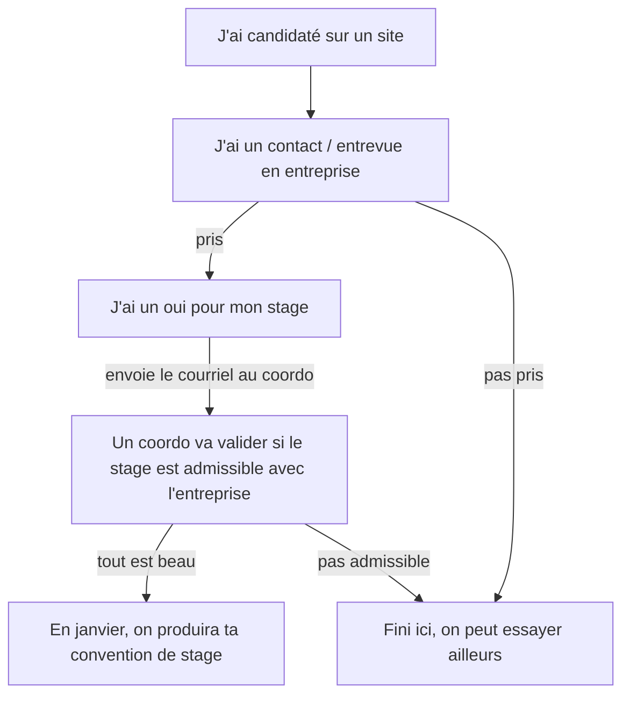

# Stages finissants : page étudiants

## Je veux me chercher un stage

Par ordre de chance de succès:
1. Si j'ai une job actuellement, demander s'il y a un département informatique au Québec
2. Utiliser mon réseau personnel et prévenir tout le monde que je me cherche un stage en TI et/ou programmation
   - Se faire un profil Linkedin
   - Ajouter tous mes proches
   - Poster sur Linkedin que je me cherche un stage avec les dates
   - Dire à tout le monde (amis, familles)
4.Candidater sur des offres sur les sites spécialisés ou sur les sites des entreprises
5. Faire les foires d'emploi et autres salons. Il s'en tient plusieurs par automne, c'est habituellement gratuit. Penser à apporter des CV imprimés.

Toutes ces pistes peuvent te permettre de te trouver un stage. Notre expérience montre que certains moyens sont plus efficaces que d'autres.

Pour les étudiants intéressés par la cybersécurité en particulier, il est fortement recommandé de participer à des événements (HackFest, CTF etc.) pour rencontrer / se présenter à la communauté.

###Questions courantes

**Combien d'élèves se trouvent leur stage tout seul?** 
Année après année, on parle d'environ 10% des finissants arrivent avec leur stage

**En général, comment ils l'ont trouvé?** 

Souvent par un proche qui travaille dans l'entreprise en question. Parfois il s'agit de l'entreprise où ils travaillent pour leur job d'étudiant qui a un service informatique. Rarement, ils ont candidaté sur un site et ont été pris.

**Est-ce que je dois arrêter mes recherches à un moment donné?** 

La date officielle des stages est le 4 mars mais si tu n'as pas encore de stage, nous validerons un stage d'été ou même un premier emploi dans le domaine. Donc on cherche jusqu'à ce qu'on trouve.

**Est-ce que je peux candidater sur des emplois ou seulement des stages?**

Les deux. Nous validerons les 10 premières semaines de ton emploi en informatique pour la technique.

## J'ai trouvé un stage par moi-même, quoi faire

Dans quelques cas, on peut contacter l'entreprise avant que tu obtiennes un "oui" si tu souhaites qu'on valide avant.

#### Questions courantes:

**Je peux quand même candidater aux offres affichées?** 

Oui, les coordos vont chercher les offres pour tous les finissants. Si tu trouves une offre qui t'intéresse plus que le stage déjà trouvé, tu pourrais faire une candidature

**Quelles sont les conditions pour qu'un stage soit admissible pour la technique?** 

Les conditions sont les suivantes:
  1. le mandat doit correspondre aux compétences de la techniques. Dur de donner une réponse générale ici, nous regardons entre coordos
  2. il doit y avoir un superviseur qualifié et motivé dans l'entreprise. Le département informatique ne doit pas être exclusivement constitué de stagiaires
  3. le stage doit couvrir un minimum de 315 heures. Nous demandons actuellement que le stages dure 10 semaines
  4. l'entreprise doit avoir une présence physique dans le grand Montréal

## Je veux candidater aux offres affichées par la coordination de stages
 En construction
